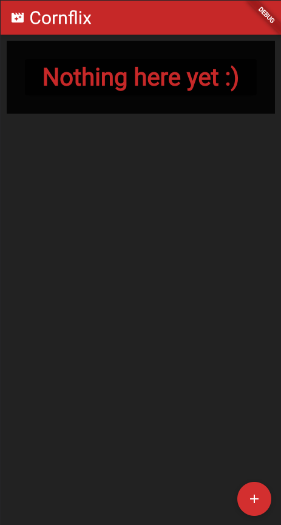
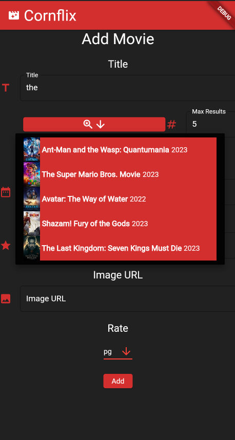
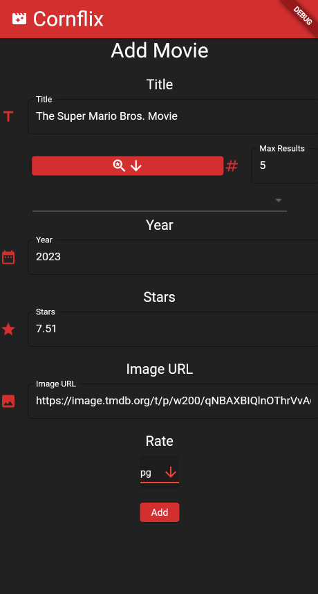
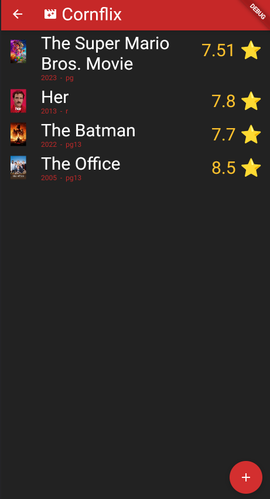
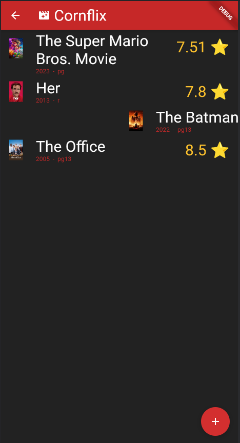
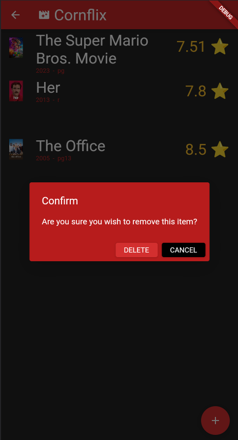

# final_project

A new Flutter project, to create a To Watch List of movies and tv shows (incomplete, on hold)

Initially:

Search for a movie or tv show.
result will be from TMDB API

Choosing an option auto fills the fields

movies added to list

swipe to delete

confirm delete

